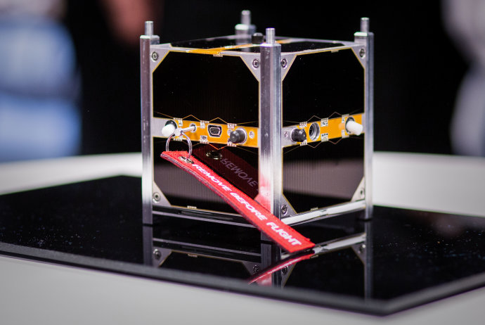

# morse_transmitter
* Morse code transmitter for cubesats or hamradio activity
* Data from 🛰 🌌 space

  Source code by NEEDRONIX s.r.o. Slovakia, Europe (c)2017
  This C source code is from cubesat satellite skCUBE prepared for public use.

### Author
* Robert Laszlo, OM1LD

## skCube 

[video with real sound of this source](https://www.youtube.com/watch?v=ggRdPaawQAI)

### NOTE
* see note in source file
